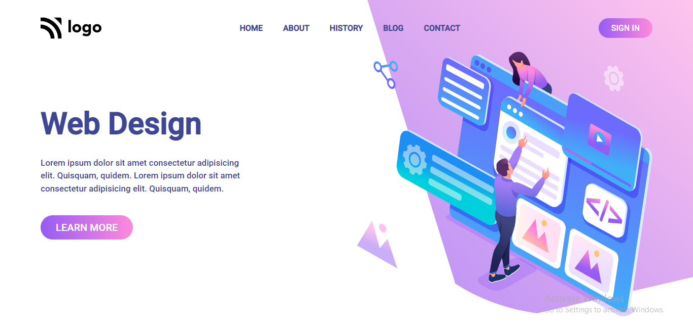

# Portfolio Project 8

## Description

This project is a landing page for a web design firm. It is built using HTML and CSS and is responsive for both mobile and tablet screens.

### Learnings from this project -

- How to use CSS `Flexbox` to position HTML elements
- How to use CSS `position` property to position images
- How to use CSS `clip-path` property to clip images
- How to use CSS `linear-gradient()` function

### Preview of the project

### [**Live link**](https://portfolio-project-8-murex.vercel.app/) of the project.
